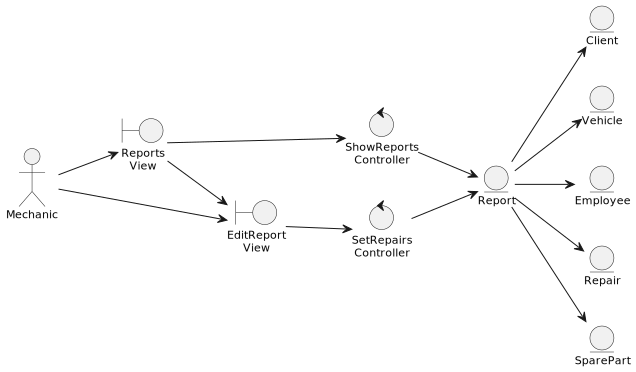
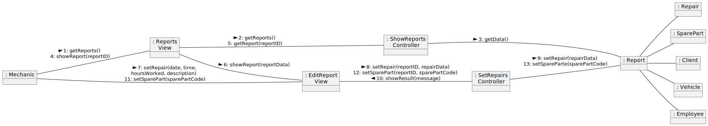

# Taller mecánico

## Descripción Aplicación
En un taller mecánico se detectan los problemas que tiene un vehículo con la ayuda del personal receptor del vehículo. Dicho personal, elabora un reporte donde anota los problemas detectados al vehículo. Seguidamente el mecánico hace los arreglos pertinentes en función de lo indicado en el reporte. El gerente del taller es el encargado de elaborar y entregar la factura al cliente, para luego proceder a cobrarle por el servicio prestado.
Todo este trabajo se lleva a mano, hacer el reporte no es más que registrar la información pertinente en hojas de papel, información tal como: marca, modelo, placa, número de serie del motor y cantidad de puestos, los problemas que presenta el vehículo, daños evidentes en el vehículo que sucedieron antes de entrar en el taller y los datos del cliente para realizar la facturación.
Luego, en el mismo papel, los mecánicos, apuntan las reparaciones que van realizando, que repuestos usaron, cuándo se empezó a realizar el trabajo y el tiempo que tomó terminar. Esta última información es importante, dado que, a finales de semana, el jefe del taller revisa una a una todas las hojas y va sumando las horas de todos los mecánicos manualmente, para poder entregar un bono por rendimiento a los mecánicos. Por último, también se lleva en papel la información del personal que trabaja en dicho taller, información como: nombre, apellido, documento de identidad y cargo que ocupa.

## Metodología
La aplicación esta requisitada y diseñada usando la metodología UP. Al ser una metodología dirigida por casos de uso, se podrá realizar una traza desde los requisitos, hasta el código implementado. Esta trazabilidad permite verificar la transformación de los requisitos en elementos de modelo sucesores, resultantes del análisis y diseño, implementación, pruebas y despliegue.

|  Trazabilidad de Requisitos por disciplinas |
| :---: |

## Modelo de Dominio
### Diagrama de clases
|  |
| :---: |

### Diagrama de contexto
|  |
| :---: |

## Modelo de Casos de uso
### Diagrama de casos de uso
|  |
| :---: |

### Especificaciones de casos de uso
La descripción de cada caso de uso lo podrá ver en: [especificaciones de los casos de uso](scenariosView/useCaseModel/simplificado/especificacionCasosUso.pdf)

### Diagrama de contexto
|  |
| :---: |

### Prototipo de interfaz
Los prototipos de las pantallas las podrá ver en: [prototipo de pantallas](scenariosView/useCaseModel/simplificado/prototipo/prototype.md)

<!--
### Trazabilidad entre pantallas y casos de uso
|  |
| :---: |
-->

## Modelo de Análisis
### Realización de análisis de casos de uso

#### Diagrama de clases de análisis de UC1 – Elaborar reporte

#### Diagrama de colaboración de análisis de UC1 – Elaborar reporte

#### Diagrama de clases de análisis de UC2 – Apuntar Reparaciones

#### Diagrama de colaboración de análisis de UC2 – Apuntar Reparaciones

### Diagrama de clases de análisis

### Arquitectura de análisis

