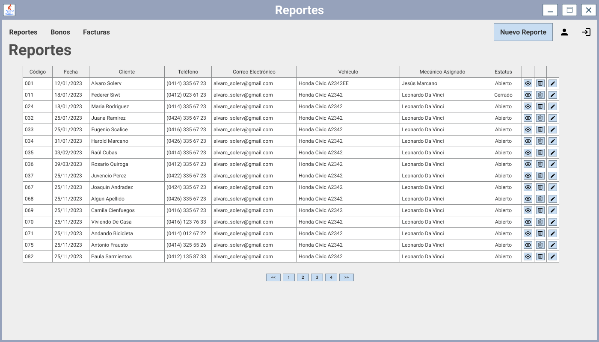
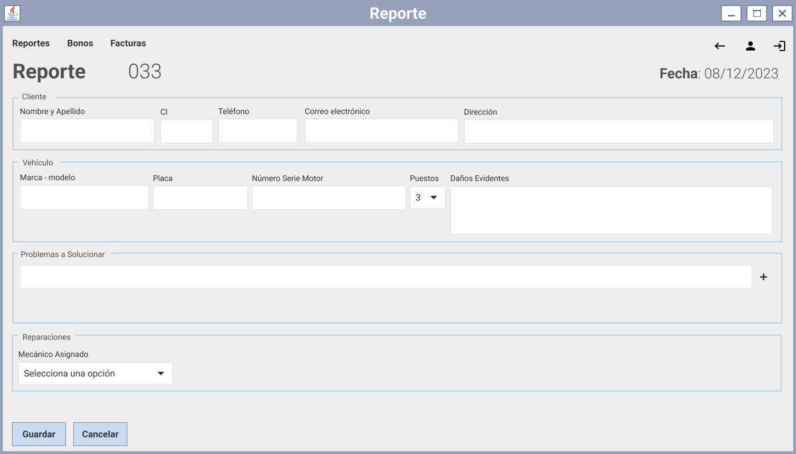
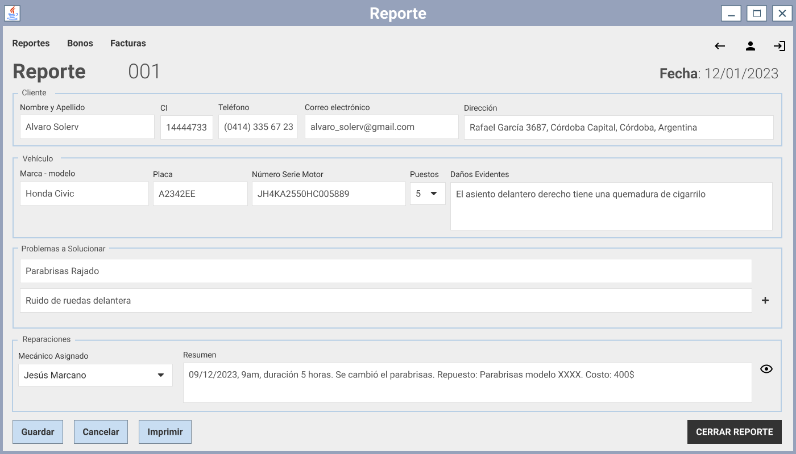

# Prototipo de pantallas

## Pantalla Reportes

|  |
| :---: |

## Pantalla nuevo reporte

|  |
| :---: |

## Pantalla Editar Reporte

|  |
| :---: |

Fuente: https://www.figma.com/file/RwaqADTGp84Kmweg6xaGOH/tallerMecanico?type=design&node-id=13-528&mode=design&t=l1hfdwq4XX1LQhMJ-0